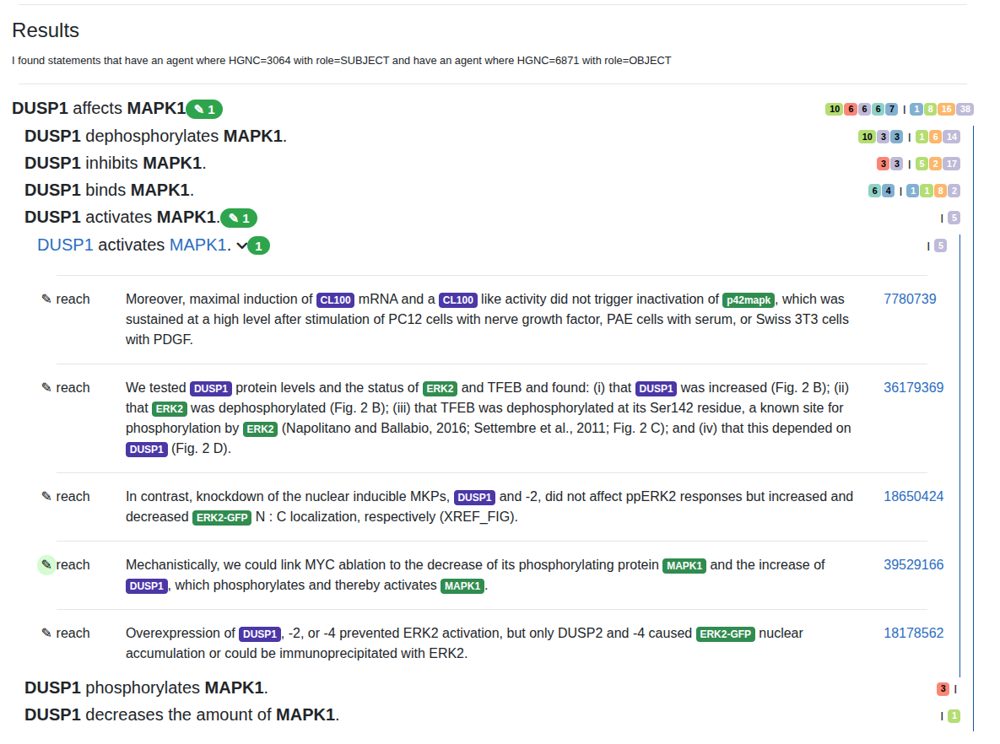

INDRA DB Search Interface
=========================

On the landing page of the INDRA DB web interface, you can search for statements by
agent name, statement type, MeSH term, or paper. By default, an unfilled agent search
option is displayed. You can add additional search options by selecting one from the
dropdown below the current list of search options. You can also remove a search option
by clicking the "X" button next to it. Once you have entered your search criteria, click
the "Search" button to retrieve the statements that match your search criteria.

Search Options
--------------

The search options are as follows:

* Agent: search by a specific entity (gene, small molecule, biological process, etc.)
  The options are:

  * role:

    * subject: the agent is an upstream/controller in retrieved statements
    * object: the agent is downstream/controlled in retrieved statements
    * any: any role is allowed
  * text: Enter the name of the agent
  * namespace and Gilda grounding option: Typically it's more reliable to query the DB
    using identifiers rather than informal names. If you know the identifier for e.g., a
    gene, say "HGNC:1234", you enter '1234' in the text box and then chose 'hgnc' in the
    namespace dropdown. However, if you only know the name, the Gilda grounding option
    is useful. If you enter e.g., "K-ras" and click "Ground with GILDA", it will
    automatically find an identifier for it. If there is ambiguity, you can select the
    correct entity from a dropdown. Once you click "Search", the DB will be queried
    using the ID selected from the dropdown.
* Type: the type of statement e.g. Activation, Phosphorylation, DecreaseAmount, Complex,
  etc. Read more about the types of statements in the INDRA documentation:
  https://indra.readthedocs.io/en/latest/modules/statements.html
* MeSH: a Medical Subject Headings term that the papers retrieved as evidence are
  annotated with. This option also has the option to ground with Gilda if you only know
  the name of the MeSH term.
* Paper: Limit the search to a specific publication that evidence comes from. To include
  multiple papers, select another paper search option from the dropdown. In the paper
  search option, you can search by these publication identifiers:

  * PMID: PubMed ID
  * PMCID: PubMed Central ID
  * DOI: Digital Object Identifier
  * TRID: FixMe: what is this?
  * TCID: FixMe: what is this?

Search Results
--------------

The search results are displayed in hierarchical list format. At the top level, the
most generic form of interaction matching the search criteria are displayed. Clicking
on one of the rows expands the next level of detail, showing the specific forms of
interactions that match the search criteria. Clicking on one of these rows expands the
next level of detail, showing the specific statements that match the search criteria.
The nesting is at most three levels deep, but can also be less if e.g., there is only one
statement type for one interaction type.

  *Search results view with three levels of nesting expanded for USP15 affecting BARD1*
