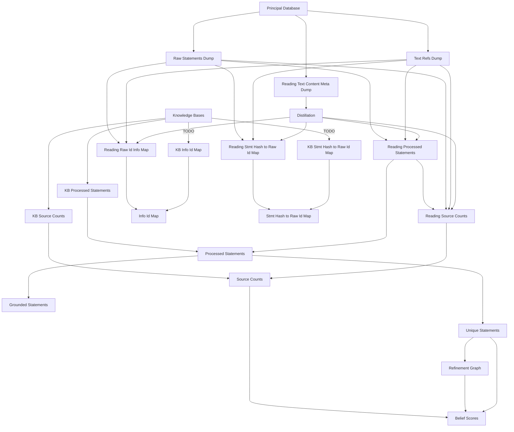

# The Readonly DB Creation Pipeline

This README describes the pipeline used for creating the readonly database.

Todos (as of 2023-11-22):
- [ ] Add mappings from KB statements so merge with reading statements can 
  be done
  - [X] Source counts
  - [ ] Raw statement id to db_info_id, reading_id, and statement json
  - [ ] Statement hash to raw statement id
- [ ] Write function for merge distilled and preassembled statements from 
  reading and database sources
- [ ] Write script to run the table file creations
- [ ] Add code to dump a restore file from the readonly database and upload 
  it to S3

## Overview

The pipline consists of four steps. The three initial steps prepare the data
and the last step generates the files for each of the tables in the readonly
database. Steps 1-3 are run in `indra_db/readonly_dumping/export_assembly.py` 
and step 4 is run in `indra_db/readonly_dumping/readonly_dumping.py`.

1. Dumping raw statements from the principal database and processing them.
   This is done in `export_assembly.py`.
2. Getting new statements from various knowledge bases and processing them.
   This is done in `indra_db/cli/knowledgebase.py`, and is called by the
   script in `export_assembly.py`.
3. Merging the raw statements from the principal database and the knowledge
   bases. This is also done by the script in `export_assembly.py`.
4. The above steps will produce a set of seed files that are used to create 
   ingestion files for the different tables for the readonly database. This 
   is done in `readonly_dumping.py`.
5. The ingestion files are then used to create the readonly database.
6. Dump a restore file from the readonly database and upload it to S3.
7. Create a new readonly database on AWS RDS (manual step).
8. Restore the readonly database from the restore file on S3 (manual).
9. Transfer services to the new readonly database (manual).

## Setup and prerequisites

### PostgreSQL and local DB instance

PostgreSQL is required to run the pipeline. A local instance of the readonly 
database will be created in the process. Make sure there is enough space on 
the disk to hold the database, typically ***XXX*** GB.

#### Installing and Starting PostgreSQL on Ubuntu

**Status: Tested on EC2 instance**

See the https://help.ubuntu.com/community/PostgreSQL for details.

To install run:
```shell
sudo apt-get install postgresql
# or, optionally, specify the version:
sudo apt-get install postgresql-12
```

Get a local PostgreSQL server running
```shell
sudo -u postgres psql postgres
```

If it works, you should see something like:
```
psql (12.13 (Ubuntu 12.13-1.pgdg20.04+1))
Type "help" for help.

postgres=#
```

(`postgres=#` means you're in the PostgreSQL server terminal)

_TODO: add more details on moving data directory_

#### Set Up User and Database

**Status: Tested on EC2 instance**

In the PostgreSQL terminal, create a user and set its password using
`\password <username>`:

```postgresql
\password postgres
```

You will be prompted to set a password, e.g. 'my_password'.

To create a database, run the following:

```shell
sudo -u postgres createdb my_db_name
```

These credentials will be used to connect to the database in the pipeline.

### INDRA DB Lite

Indra DB Lite is not strictly required to run the pipeline, but significantly
speeds up the process. It is recommended to set it up. Here follows 
instructions more or less copied from the repository README.

1. Clone the repository:
   `git clone https://github.com/gyorilab/indra_db_lite.git`
2. Install the package: `pip install -e .` at the root of the repository.
3. Set the environment variable `INDRA_DB_LITE_S3_BUCKET` to the name of the
   S3 bucket where the database is stored.
4. Set the environment variable `INDRA_DB_LITE_LOCATION` to where you would 
   like the decompressed database file to be stored locally. The file 
   requires about 150 GB of space when decompressed, so ensure that you have 
   enough space in the location you specify.
5. Once the environment variables are set, run 
   `python -m indra_db_lite.download` to download the sqlite db file to your 
   machine and decompress it. Note that it may take over an hour to download
   and decompress the db file. Once completed, indra_db_lite should be ready
   to use.

### Adeft

Install by running `pip install adeft`.

Download resource files using `python -m adeft.download`.

## Pipeline Steps

The pipeline is run using from the file
`indra_db/readonly_dumping/export_assembly.py`. The sections below describe
the steps in the pipeline, but none of them should be run directly. Instead,
run the script `export_assembly.py` with the appropriate arguments.

### Initial dumping and Processing

#### Dumping of Raw Statements, Text Content, and Text Refs

**Status: Implemented**

The first step of the pipeline is to dump out three resource files from the
principal database. These files are:

1. `raw_statements.tsv.gz` from the raw statements table, containing
   the following columns:
   - `id`: the raw statement id
   - `db_info_id`: which database the statement came from, if it's from a
     database source.
   - `reading_id`: which reading source the statement came from, if it's 
     from a reading source.
   - `raw_statement_json`: the raw statement in JSON format.
2. `reading_text_content_meta.tsv.gz`, a file containing joined data from
   the text content and reading tables containing the following columns:
   - `reading_id`: the reading id; which reading source the statement came
     from, if it's from a reading source.
   - `reader_version`: the version of the reading source.
   - `text_content_id`: Key to an entry un the `text_content` table
     containing text data and metadata.
   - `text_ref_id`: Key to an entry in the `text_ref` table containing
     information identifying the text content, e.g. the pmid.  
   - `text_content_source`: The source of the text content, e.g. `pmc_oa` or 
     `pubmed`.
   - `text_content_text_type`: The type of text content, e.g. `abstract` or 
     `fulltext`.
3. `text_refs_principal.tsv.gz` from the text_refs table, containing the
   following columns:
   - `text_ref_id`: the text ref id
   - `pmid`: the pmid of the paper the text ref is associated with.
   - `pmcid`: the corresponding pmcid, if available.
   - `doi`: the doi of the paper.
   - `pii`: the pii of the paper.
   - `url`: The url if a source is found exclusively online.
   - `manuscript_id`: The ID assigned documents given to PMC author 
     manuscripts.

#### Knowledge Bases Update

**Status:**
- [X] Write script for local update
- [ ] Save statement hash to raw statement id mapping
- [X] Save source counts and create code to merge with reading source counts
- [ ] Map "raw id" of kb statements to db_info_id, reading_id, and statement json
- [X] Add knowledge base update to export_assembly.py

_The code for this section is in `indra_db/cli/knowledgebase.py`, but is run 
from `export_assembly.py`._

The next step is to get new statements from various knowledge bases. The 
script `local_update` in `indra_db/cli/knowledgebase.py` is called which 
ultimately dumps out one file per knowledge base with all the statements 
from that source.

_NOTE: The code to generate the three files below containing metadata still 
needs to be written._

Once the script is done, mappings from statement hashes to raw statement ids, 
source counts, and mappings from raw statement ids to db_info_id, reading_id, 
and statement json are produced as well.

#### Distillation and Preassembly of Principal Statements

**Status: Implemented**

The next step is to distill and preassemble the principal statements. This is
done in `export_assembly.py` by calling the function `preassemble_statements`

#### Merging of Knowledge Base and Reading Statements

**Status: Not implemented; Also requires mappings from "_Knowledge Bases 
Update_"**

At this step, the distilled and preassembled statements from both reading and 
database sources are merged. This is done in the function
`merge_processed_statements` in `export_assembly.py`.

#### Grounding and Deduplication

**Status: Implemented**

The final task for preparing statements is grounding and deduplication which 
is done in `ground_deduplicate` in `export_assembly.py`.

#### Refinement Graph and Belief Scoring

**Status: Implemented**

Once all the statements are prepared, a refinement graph of all statements 
is created, from which the belief scores of the statements are calculated.
The refinement graph creation and the belief scores calculation is done in 
`get_refinement_graph` and `get_belief_scores` in `export_assembly.py`,
respectively.

### Constructing Files for the Read-Only Database

**Status:**
- [X] Functions to create files for individual tables
- [ ] Script to run the file creation functions (some of the tables are 
  dependent on others, so the order of creation matters)

Once the statements are prepared, the files for the read-only database can be
constructed. This is done in `readonly_dumping.py`. The script takes the
following arguments:

- `--db-name`: The name of the database to connect to. Defaults to 
  `indradb_readonly_local`.
- `--db-user`: The user to connect to the database with. 
- `--db-password`: The password to connect to the database with.
- `--hostname`: The host of the database. Defaults to `localhost`.
- `--port`: The port of the database. Defaults to `5432`.
- `--force`: If set, the script will delete the data in the tables before
  inserting new data. Defaults to `False`.

### Create a Restore File

Dump a restore file from the readonly database and upload it to S3.

**Status: Not Implemented (code from current setup can be adapted)**

# Graph of the Pipeline

This graph shows the dependencies between the different files in the initial
part of the pipeline that produces the seed files.


[//]: # (TODO: Add the second pipeline step to the graph or another graph)
